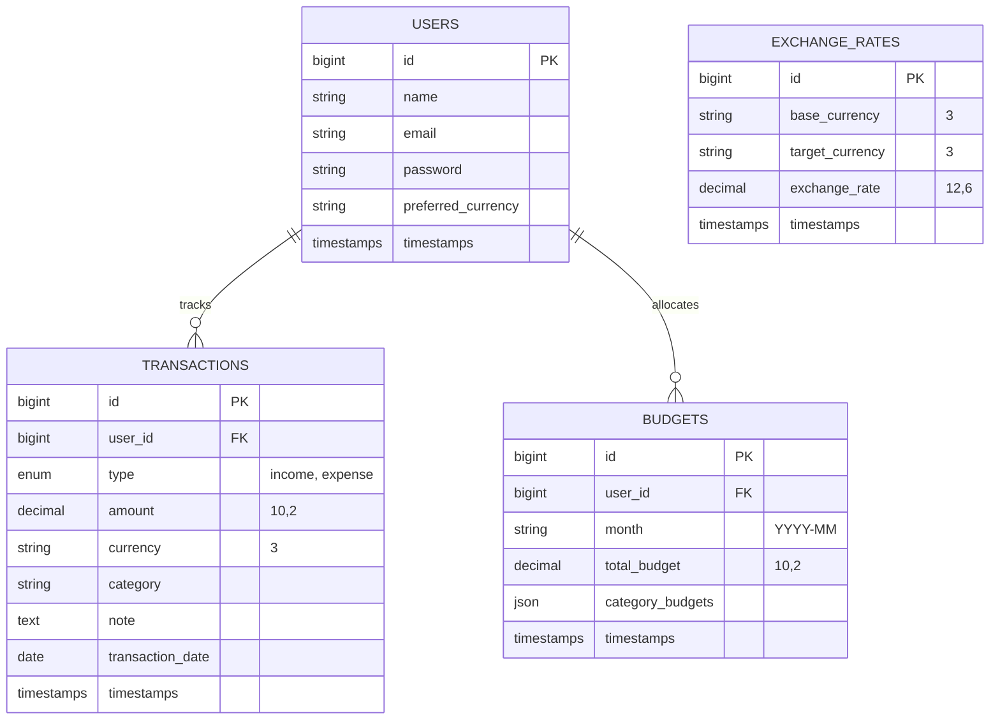

# ACADEMIC PROJECT REPORT: BUDGETX PERSONAL FINANCE & DYNAMIC BUDGET PLANNER
**Course Code**: MVC Programming (Semester 6)  
**Academic Institution**: Lovely Professional University (LPU)

---

## 1. PROJECT OVERVIEW
**BudgetX** is a premium, real-time multi-currency Personal Finance and Budget Management system. Developed using the robust **Model-View-Controller (MVC)** architectural pattern, the platform combines a secure, fast **Laravel (PHP)** RESTful API backend with a fluid, high-fidelity **React (Vite)** single-page frontend. 

It is designed to give users comprehensive, real-time control over their financial health by tracking income and expenditures, defining spending limits (both globally and category-specific), viewing comparative visual insights, and downloading audited monthly ledgers (in CSV, Excel, and PDF formats).

---

## 2. SYSTEM ARCHITECTURE & THE MVC PATTERN
BudgetX is built on a strictly decoupled **MVC (Model-View-Controller)** pattern. In this decoupled layout, the Laravel backend implements the **Model** (data schemas and Eloquent engines) and **Controller** (routes, requests, validations, and logic) layers. The React frontend implements a responsive, reactive **View** layer that communicates with the controller via asynchronous JSON calls.

```mermaid
graph TD
    subgraph View Layer (React & Vite)
        UI[React Components & Pages]
        State[React Context API & Axios Client]
    end

    subgraph Controller Layer (Laravel Framework)
        Routes[API Routing: api.php]
        AuthMid[Sanctum & Custom Middleware]
        Ctrl[Laravel API Controllers]
    end

    subgraph Model Layer (Eloquent & Database)
        Models[Eloquent Models]
        DB[(MySQL Relational Database)]
    end

    UI -->|1. User Inputs / Events| State
    State -->|2. Asynchronous HTTP Requests| Routes
    Routes -->|3. Route Handshaking| AuthMid
    AuthMid -->|4. Request Validations| Ctrl
    Ctrl -->|5. Query / Mutate Records| Models
    Models -->|6. SQL Statements Execution| DB
    DB -->|7. Data Return| Models
    Models -->|8. Eloquent Collection Object| Ctrl
    Ctrl -->|9. Standardized JSON Response| State
    State -->|10. Trigger Context / Component Updates| UI
```

### 2.1 The Model Layer (Laravel Eloquent)
*   **Eloquent Models**: Located inside `app/Models/` (`User`, `Transaction`, `Budget`, `ExchangeRate`). These declare logical constraints, data casting (e.g., casting JSON fields to arrays), and relational links (e.g., `User hasMany Transactions`).
*   **Relational Cache**: Employs local tables (like `exchange_rates`) to cache API endpoints, avoiding external network latency.

### 2.2 The Controller Layer (Laravel Routing & Handlers)
*   **API Routes**: Declared inside `routes/api.php`, linking URIs directly to controller methods under security filters.
*   **Controllers**: Located inside `app/Http/Controllers/`. They parse incoming JSON payloads, run validations (e.g., duplicate submission filters), coordinate database models, and respond with JSON.
*   **Security Filters**: Integrated Sanctum guards verify user tokens before executing sensitive controller functions.

### 2.3 The View Layer (React UI Engine)
*   **React Components**: Modular components (charts, modals, sliders, and ledger grids) that manage state independently.
*   **Axios Client**: Features automatic request interceptors to inject local storage Sanctum tokens as Bearer headers.
*   **Framer Motion**: Incorporates hardware-accelerated animations for fluid page transitions.

---

## 3. DATABASE SCHEMA DESIGN
The relational schema is configured to ensure fast lookup speeds, clean entity relations, and strict data integrity. The schema structure is automatically established via database migrations.



### 3.1 Relational Table Definitions

#### 1. `users` Table
Stores account profiles, authentication data, and default localization settings.
*   `id` (BIGINT, Primary Key, Auto-increment)
*   `name` (VARCHAR, 255)
*   `email` (VARCHAR, 255, Unique Index)
*   `password` (VARCHAR, 255)
*   `preferred_currency` (VARCHAR, 3) - Default: `'USD'`
*   `timestamps` (`created_at`, `updated_at`)

#### 2. `transactions` Table
Tracks user incomes and expenses.
*   `id` (BIGINT, Primary Key, Auto-increment)
*   `user_id` (BIGINT, Foreign Key referencing `users(id)`, On Delete Cascade)
*   `type` (ENUM: `'income'`, `'expense'`)
*   `amount` (DECIMAL, 10, 2)
*   `currency` (VARCHAR, 3) - ISO 3-letter currency code (e.g., `'USD'`, `'INR'`)
*   `category` (VARCHAR, 255) - e.g., `'Food'`, `'Rent'`, `'Bills'`, `'Other'`
*   `note` (TEXT, Nullable)
*   `transaction_date` (DATE) - Index for chronological lookups
*   `timestamps` (`created_at`, `updated_at`)

#### 3. `budgets` Table
Defines spending caps per user on a monthly basis, now including category limits.
*   `id` (BIGINT, Primary Key, Auto-increment)
*   `user_id` (BIGINT, Foreign Key referencing `users(id)`, On Delete Cascade)
*   `month` (VARCHAR, 7, Index) - Formatted as `YYYY-MM` to enforce unique budgets per month
*   `total_budget` (DECIMAL, 10, 2)
*   `category_budgets` (JSON, Nullable) - Stores allocations for specific categories: `{ "Food": 500, "Bills": 300, ... }`
*   `timestamps` (`created_at`, `updated_at`)

#### 4. `exchange_rates` Table
Caches conversion exchange rates locally.
*   `id` (BIGINT, Primary Key, Auto-increment)
*   `base_currency` (VARCHAR, 3) - Default: `'USD'`
*   `target_currency` (VARCHAR, 3)
*   `exchange_rate` (DECIMAL, 12, 6)
*   `timestamps` (`created_at`, `updated_at`)

---

## 4. CORE FUNCTIONAL MODULES

### 4.1 Sanctum Token-Based Authentication
*   **Authentication Flow**: Powered by **Laravel Sanctum**. User login or registration yields a highly secure API token, which is cached in the browser's `localStorage` and sent with every Axios API call via headers.
*   **Sanctum Guard**: Protects routes against unauthenticated requests, preventing visual data leaks.

### 4.2 Real-time Dashboard & Stats
*   **API Consolidation**: Fetches statistics asynchronously through a single consolidated endpoint (`GET /api/dashboard-data?month=YYYY-MM`), returning:
    *   `net_balance` (Income - Expenses)
    *   `monthly_income` & `monthly_expense` (Current month totals)
    *   `budget_percentage` (Current budget utilization)
    *   `recent_transactions` (Top 5 ledger rows)
*   **Loading Skeletons**: Renders premium placeholder skeletons during active fetch states to eliminate page lag.

### 4.3 Category-Wise Budget Allocation (`SetBudgetModal`)
*   **Dynamic Modal**: Users can input a monthly limit and allocate specific funds for categories: Food, Shopping, Bills, Travel, Entertainment, and Other.
*   **Autosum Synchronization**: When users type values into category boxes, the frontend dynamically adds them together to calculate and sync the total budget.
*   **Intelligent Overwrite**: Automatically performs database merges if a budget has already been established for the selected month, keeping the user profile clean.

### 4.4 Circular Spending Utilization Indicator (`ProgressCircle`)
*   **Dynamic SVG Ring**: Renders an interactive circular spending indicator that visualizes budget consumption.
*   **Color-Coded Warning Tiers**: Adjusts the ring color dynamically based on budget utilization:
    *   🟢 **Emerald Green (0 - 70%)**: Safe, healthy spending pacing.
    *   🟡 **Amber Yellow (71% - 90%)**: Normal warning thresholds.
    *   🟠 **Orange Warning (91% - 100%)**: Critical budget ceilings.
    *   🔴 **Rose Red (> 100%)**: Exceeded budget thresholds with visual overdraft alerts.

### 4.5 Dual-Bar Recharts Graph (`BudgetVsActualChart`)
*   **Side-by-Side Comparison**: Renders two vertical bars for each of the six primary spending categories: Budget allocation vs. Actual spending.
*   **Contextual Cell Highlighting**: The actual expenditure bar dynamically turns green if spending is within the category limit, and red if it exceeds the limit.
*   **Interactive Tooltip**: Hovering over the bars reveals details of remaining category funds.

### 4.6 Unified Statement Preview & Export Center (`MonthlyStatement`)
*   **Statement Preview**: Integrated inside the **Reports & Ledger Audits** page. Displays monthly income, expenses, and category stats for any month/year selected with the premium month picker.
*   **Secure Exports**: Employs Axios streams to retrieve blobs, preventing Sanctum tokens from leaking in browser URLs. Generates files in three formats on click:
    *   `CSV File`: Raw comma-separated spreadsheets.
    *   `Excel Ledger`: Tab-delimited formatting compatible with Microsoft Excel and Google Sheets.
    *   `Print PDF`: Styled printable views equipped with `@media print` CSS rules.

### 4.7 Accidental Duplicate Transaction Debouncer
*   **Backend Debouncer**: Enforces a temporary 5-second backend debouncing check inside `TransactionController.php`. If concurrent requests attempt to submit identical transactions (same amount, category, type, date), the server blocks duplicate entries and returns a `422 Unprocessable Content` response.

---

## 5. TECHNICAL CODE EXAMPLES

### 5.1 Backend: Storing Total & Category Budgets
This controller handles the creation and updates of total and category-specific monthly budgets:

```php
// app/Http/Controllers/API/DashboardController.php
public function saveBudget(Request $request)
{
    $request->validate([
        'month' => 'required|date_format:Y-m',
        'total_budget' => 'required|numeric|min:0.01',
        'category_budgets' => 'nullable|array'
    ]);

    $user = $request->user();

    $budget = Budget::updateOrCreate(
        [
            'user_id' => $user->id,
            'month' => $request->month,
        ],
        [
            'total_budget' => $request->total_budget,
            'category_budgets' => $request->category_budgets ?: []
        ]
    );

    return response()->json([
        'message' => 'Budget saved successfully',
        'budget' => $budget
    ]);
}
```

### 5.2 Backend: Generating Budget vs Actual Spending Details
This endpoint fetches category budget allocations and matches them against transaction expenses:

```php
// app/Http/Controllers/API/DashboardController.php
public function budgetVsActual(Request $request)
{
    $month = $request->get('month', date('Y-m'));
    $user = $request->user();

    // Fetch set budget
    $budget = Budget::where('user_id', $user->id)
        ->where('month', $month)
        ->first();

    // Map out primary categories
    $categories = ['Food', 'Shopping', 'Bills', 'Travel', 'Entertainment', 'Other'];
    $actuals = [];
    $budgets = [];

    // Aggregate monthly actual expenses per category
    $expenses = Transaction::where('user_id', $user->id)
        ->where('type', 'expense')
        ->whereYear('transaction_date', substr($month, 0, 4))
        ->whereMonth('transaction_date', substr($month, 5, 2))
        ->groupBy('category')
        ->selectRaw('category, SUM(amount) as total')
        ->pluck('total', 'category');

    $categoryLimits = $budget ? ($budget->category_budgets ?: []) : [];

    foreach ($categories as $cat) {
        $actuals[] = $expenses->get($cat, 0);
        $budgets[] = $categoryLimits[$cat] ?? 0;
    }

    return response()->json([
        'categories' => $categories,
        'budget' => $budgets,
        'actual' => $actuals
    ]);
}
```

### 5.3 Frontend: Dynamic Circular Spending Progress Ring
The React SVG circle calculates stroke arrays dynamically based on budget utilization:

```javascript
// frontend/src/components/ProgressCircle.jsx
export default function ProgressCircle({ percentage, size = 160 }) {
    const strokeWidth = 14;
    const radius = (size - strokeWidth) / 2;
    const circumference = radius * 2 * Math.PI;
    const offset = circumference - (Math.min(percentage, 100) / 100) * circumference;

    // Get color dynamically based on budget utilization
    const getStrokeColor = () => {
        if (percentage >= 100) return '#ef4444'; // Red (Overdraft)
        if (percentage >= 90) return '#f97316';  // Orange (Critical)
        if (percentage >= 70) return '#f59e0b';  // Yellow (Warning)
        return '#10b981';                         // Green (Safe)
    };

    return (
        <div className="relative flex items-center justify-center" style={{ width: size, height: size }}>
            <svg width={size} height={size} className="transform -rotate-90">
                {/* Background Ring */}
                <circle cx={size/2} cy={size/2} r={radius} fill="transparent" stroke="#1e293b" strokeWidth={strokeWidth} />
                {/* Progress Ring */}
                <circle
                    cx={size/2}
                    cy={size/2}
                    r={radius}
                    fill="transparent"
                    stroke={getStrokeColor()}
                    strokeWidth={strokeWidth}
                    strokeDasharray={circumference}
                    strokeDashoffset={offset}
                    strokeLinecap="round"
                    className="transition-all duration-500 ease-out"
                />
            </svg>
            <div className="absolute flex flex-col items-center">
                <span className="text-3xl font-black text-slate-100">{percentage}%</span>
                <span className="text-[10px] text-slate-500 font-extrabold uppercase tracking-widest mt-0.5">Used</span>
            </div>
        </div>
    );
}
```

---

## 6. LOCAL SETUP & RUNNING INSTRUCTIONS

### 6.1 Backend Setup
1.  Navigate to the `backend/` directory:
    ```bash
    cd backend
    ```
2.  Install dependencies:
    ```bash
    composer install
    ```
3.  Configure your environment in `.env`:
    ```env
    DB_CONNECTION=mysql
    DB_HOST=127.0.0.1
    DB_PORT=3306
    DB_DATABASE=budgetx
    DB_USERNAME=root
    DB_PASSWORD=
    ```
4.  Generate application security keys:
    ```bash
    php artisan key:generate
    ```
5.  Execute migrations to create the database schema:
    ```bash
    php artisan migrate
    ```
6.  Start the local development server:
    ```bash
    php artisan serve
    ```
    *The backend API will now be running at `http://localhost:8000/api`.*

### 6.2 Frontend Setup
1.  Navigate to the `frontend/` directory:
    ```bash
    cd ../frontend
    ```
2.  Install dependencies:
    ```bash
    npm install
    ```
3.  Start the Vite dev server:
    ```bash
    npm run dev
    ```
    *The React application will now be running at `http://localhost:5173`.*

---

## 7. CONCLUSION
The **BudgetX** application successfully demonstrates a decoupled **Model-View-Controller** system. By decoupling the layers, the platform achieves high rendering speeds on the frontend and secure query execution on the backend, delivering a professional personal finance dashboard that aligns with modern web development standards.
